# Дипломный практикум в Yandex.Cloud

## 1. Создание облачной инфраструктуры

Необходимо подготовить облачную инфраструктуру в ЯО при помощи Terraform с возможностью дальнейшей конфигурации.

### 1.1 Создание каталога Yandex.Cloud

Версия terraform

```
Terraform v1.4.6
on linux_amd64
```

[Конфигурация terraform](./terraform/catalog)

- folder.tf - Создание каталога
- provider.tf - Объявление провайдера YC
- variables.tf - Переменные
- storage_bucket_key.tf - Создание ключа для шифрации Storage Bucket
- storage_bucket.tf - Создание Storage Bucket
- service_account.tf - Создание Service Account
- outputs.tf - вывод необходимой информации

Инициализируем конфигурацию terraform

```
Initializing the backend...

Initializing provider plugins...
- Finding latest version of yandex-cloud/yandex...
- Installing yandex-cloud/yandex v0.91.0...
- Installed yandex-cloud/yandex v0.91.0 (self-signed, key ID E40F590B50BB8E40)

Partner and community providers are signed by their developers.
If you'd like to know more about provider signing, you can read about it here:
https://www.terraform.io/docs/cli/plugins/signing.html

Terraform has created a lock file .terraform.lock.hcl to record the provider
selections it made above. Include this file in your version control repository
so that Terraform can guarantee to make the same selections by default when
you run "terraform init" in the future.

Terraform has been successfully initialized!

You may now begin working with Terraform. Try running "terraform plan" to see
any changes that are required for your infrastructure. All Terraform commands
should now work.

If you ever set or change modules or backend configuration for Terraform,
rerun this command to reinitialize your working directory. If you forget, other
commands will detect it and remind you to do so if necessary.
```

Создаем рабочее окружение prod и stage

```
aledcherry@aledcherry:~/devops-diplom-yandexcloud/src/terraform/catalog$ terraform workspace new prod
Created and switched to workspace "prod"!

You're now on a new, empty workspace. Workspaces isolate their state,
so if you run "terraform plan" Terraform will not see any existing state
for this configuration.
aledcherry@aledcherry:~/devops-diplom-yandexcloud/src/terraform/catalog$ terraform workspace new stage
Created and switched to workspace "stage"!

You're now on a new, empty workspace. Workspaces isolate their state,
so if you run "terraform plan" Terraform will not see any existing state
for this configuration.
aledcherry@aledcherry:~/devops-diplom-yandexcloud/src/terraform/catalog$ terraform workspace list
  default
  prod
* stage
```
Заранее укажем YC-токен для доступа к облаку в env, чтобы не указывать его в конфигурации из соображения безопасности
```
export YC_TOKEN=`yc iam create-token`
```
Применяем конфигурацию 
```
aledcherry@aledcherry:~/devops-diplom-yandexcloud/src/terraform/catalog$ terraform apply -auto-approve

Terraform used the selected providers to generate the following execution plan. Resource actions are indicated with the following symbols:
  + create

Terraform will perform the following actions:

  # yandex_iam_service_account.terraform-sa will be created
  + resource "yandex_iam_service_account" "terraform-sa" {
      + created_at  = (known after apply)
      + description = "Service account to allow Terraform to manage catalog"
      + folder_id   = (known after apply)
      + id          = (known after apply)
      + name        = "terraform-sa"
    }

  # yandex_iam_service_account_static_access_key.bucket-static_access_key will be created
  + resource "yandex_iam_service_account_static_access_key" "bucket-static_access_key" {
      + access_key           = (known after apply)
      + created_at           = (known after apply)
      + description          = "Static access key for Terraform Backend Bucket"
      + encrypted_secret_key = (known after apply)
      + id                   = (known after apply)
      + key_fingerprint      = (known after apply)
      + secret_key           = (sensitive value)
      + service_account_id   = (known after apply)
    }

  # yandex_kms_symmetric_key.key-a will be created
  + resource "yandex_kms_symmetric_key" "key-a" {
      + created_at        = (known after apply)
      + default_algorithm = "AES_128"
      + description       = "Simmetric key"
      + folder_id         = (known after apply)
      + id                = (known after apply)
      + name              = "symmetric-key"
      + rotated_at        = (known after apply)
      + rotation_period   = "8760h"
      + status            = (known after apply)
    }

  # yandex_resourcemanager_folder.diplom-folder will be created
  + resource "yandex_resourcemanager_folder" "diplom-folder" {
      + cloud_id   = (known after apply)
      + created_at = (known after apply)
      + id         = (known after apply)
      + name       = "netology"
    }

  # yandex_resourcemanager_folder_iam_binding.editor will be created
  + resource "yandex_resourcemanager_folder_iam_binding" "editor" {
      + folder_id = (known after apply)
      + id        = (known after apply)
      + members   = (known after apply)
      + role      = "editor"
    }

  # yandex_resourcemanager_folder_iam_binding.encrypterDecrypter will be created
  + resource "yandex_resourcemanager_folder_iam_binding" "encrypterDecrypter" {
      + folder_id = (known after apply)
      + id        = (known after apply)
      + members   = (known after apply)
      + role      = "kms.keys.encrypterDecrypter"
    }

  # yandex_resourcemanager_folder_iam_binding.storage-admin will be created
  + resource "yandex_resourcemanager_folder_iam_binding" "storage-admin" {
      + folder_id = (known after apply)
      + id        = (known after apply)
      + members   = (known after apply)
      + role      = "storage.admin"
    }

  # yandex_storage_bucket.backend-encrypted will be created
  + resource "yandex_storage_bucket" "backend-encrypted" {
      + access_key            = (known after apply)
      + acl                   = (known after apply)
      + bucket                = "tf-backend"
      + bucket_domain_name    = (known after apply)
      + default_storage_class = (known after apply)
      + folder_id             = (known after apply)
      + force_destroy         = false
      + id                    = (known after apply)
      + secret_key            = (sensitive value)
      + website_domain        = (known after apply)
      + website_endpoint      = (known after apply)

      + anonymous_access_flags {
          + list = false
          + read = false
        }

      + server_side_encryption_configuration {
          + rule {
              + apply_server_side_encryption_by_default {
                  + kms_master_key_id = (known after apply)
                  + sse_algorithm     = "aws:kms"
                }
            }
        }
    }

Plan: 8 to add, 0 to change, 0 to destroy.

Changes to Outputs:
  + yc-folder-id           = (known after apply)
  + yc-id                  = (known after apply)
yandex_resourcemanager_folder.diplom-folder: Creating...
yandex_resourcemanager_folder.diplom-folder: Creation complete after 1s [id=b1gqioump53tbqn4q6kn]
yandex_kms_symmetric_key.key-a: Creating...
yandex_iam_service_account.terraform-sa: Creating...
yandex_iam_service_account.terraform-sa: Creation complete after 1s [id=ajeqmp2ucg0466pm7f47]
yandex_resourcemanager_folder_iam_binding.encrypterDecrypter: Creating...
yandex_resourcemanager_folder_iam_binding.storage-admin: Creating...
yandex_resourcemanager_folder_iam_binding.editor: Creating...
yandex_iam_service_account_static_access_key.bucket-static_access_key: Creating...
yandex_iam_service_account_static_access_key.bucket-static_access_key: Creation complete after 1s [id=ajeouh42ia5s948u8upc]
yandex_kms_symmetric_key.key-a: Creation complete after 3s [id=abji4v8tpeqcrubro5fk]
yandex_storage_bucket.backend-encrypted: Creating...
yandex_resourcemanager_folder_iam_binding.encrypterDecrypter: Creation complete after 2s [id=b1gqioump53tbqn4q6kn/kms.keys.encrypterDecrypter]
yandex_resourcemanager_folder_iam_binding.editor: Creation complete after 3s [id=b1gqioump53tbqn4q6kn/editor]
yandex_resourcemanager_folder_iam_binding.storage-admin: Creation complete after 5s [id=b1gqioump53tbqn4q6kn/storage.admin]
yandex_storage_bucket.backend-encrypted: Still creating... [10s elapsed]
yandex_storage_bucket.backend-encrypted: Creation complete after 11s [id=tf-backend]

Apply complete! Resources: 8 added, 0 changed, 0 destroyed.

Outputs:

current-workspace-name = "stage"
yc-folder-id = "b1gqioump53tbqn4q6kn"
yc-id = "b1g4dkqda3n9tf715ll4"
yc-zone = "ru-central1"
```
Также укажем YC_CLOUD_ID и YC_FOLDER_ID, также из соображений безопасности, чтобы не хранить такие данные в конфиге
```
export YC_CLOUD_ID=b1g4dkqda3n9tf715ll4
export YC_FOLDER_ID=b1gqioump53tbqn4q6kn
```
Необходимо сгенерировать ключи для инициализации бэкенда, которое будет выполнено на следующем этапе. Для начала иницализируем yc
```
aledcherry@aledcherry:~/devops-diplom-yandexcloud/src/terraform/catalog$ yc init
Welcome! This command will take you through the configuration process.
Pick desired action:
 [1] Re-initialize this profile 'aledcherry' with new settings
 [2] Create a new profile
 [3] Switch to and re-initialize existing profile: 'alexander'
 [4] Switch to and re-initialize existing profile: 'default'
Please enter your numeric choice: `
Please enter a value between 1 and 4: 1
Please go to https://oauth.yandex.ru/authorize?response_type=token&client_id=1a6990aa636648e9b2ef855fa7bec2fb in order to obtain OAuth token.

Please enter OAuth token: [AQAAAAARP*********************VDbsxaeY0]
You have one cloud available: 'cloud-alexander' (id = b1g4dkqda3n9tf715ll4). It is going to be used by default.
Please choose folder to use:
 [1] default (id = b1gdma948ep8dtkjn5uk)
 [2] netology (id = b1gqioump53tbqn4q6kn)
 [3] Create a new folder
Please enter your numeric choice: 2
Your current folder has been set to 'netology' (id = b1gqioump53tbqn4q6kn).
Do you want to configure a default Compute zone? [Y/n] n
```
После иницализации можно пользоваться ресурсами облака
```
aledcherry@aledcherry:~/devops-diplom-yandexcloud/src/terraform/catalog$ yc iam service-account list
+----------------------+--------------+
|          ID          |     NAME     |
+----------------------+--------------+
| ajeqmp2ucg0466pm7f47 | terraform-sa |
+----------------------+--------------+
```
Необходимо сгенерировать ключ доступа для сервисного аккаунта, который был создан терраформ кофигурацией(terraform-sa)
```
aledcherry@aledcherry:~/devops-diplom-yandexcloud/src/terraform/catalog$ yc iam access-key create --service-account-name terraform-sa
access_key:
  id: ajeh41gpv8kk6uj8qa7f
  service_account_id: ajeqmp2ucg0466pm7f47
  created_at: "2023-06-03T13:15:01.369503445Z"
  key_id: YCAJEvw2-_SthSpv5w3NSSGsn
secret: YCPUPR8tGyNcOJk3bOKgvavc-DbPjQGGV2zWJSAg
```
Сохраним значение секретного ключа
```
aledcherry@aledcherry:~/devops-diplom-yandexcloud/src/terraform/catalog$ export AWS_ACCESS_KEY_ID=YCAJEvw2-_SthSpv5w3NSSGsn
aledcherry@aledcherry:~/devops-diplom-yandexcloud/src/terraform/catalog$ export AWS_SECRET_ACCESS_KEY=YCPUPR8tGyNcOJk3bOKgvavc-DbPjQGGV2zWJSAg
```
### 1.2. Создание бэкенда для хранения файлов состояния Terraform

Для создания бэкенда понадобится следующая [конфигурация terraform](./terraform/backend)

- provider.tf - Создание бэкенда в составе провайдера YC
- variables.tf - Переменные
- outputs.tf - Вывод необходимой информации

Инициализируем конфигурацию 
```
aledcherry@aledcherry:~/devops-diplom-yandexcloud/src/terraform/backend$ terraform init

Initializing the backend...

Successfully configured the backend "s3"! Terraform will automatically
use this backend unless the backend configuration changes.

Initializing provider plugins...
- Finding latest version of yandex-cloud/yandex...
- Installing yandex-cloud/yandex v0.92.0...
- Installed yandex-cloud/yandex v0.92.0 (self-signed, key ID E40F590B50BB8E40)

Partner and community providers are signed by their developers.
If you'd like to know more about provider signing, you can read about it here:
https://www.terraform.io/docs/cli/plugins/signing.html

Terraform has created a lock file .terraform.lock.hcl to record the provider
selections it made above. Include this file in your version control repository
so that Terraform can guarantee to make the same selections by default when
you run "terraform init" in the future.

Terraform has been successfully initialized!

You may now begin working with Terraform. Try running "terraform plan" to see
any changes that are required for your infrastructure. All Terraform commands
should now work.

If you ever set or change modules or backend configuration for Terraform,
rerun this command to reinitialize your working directory. If you forget, other
commands will detect it and remind you to do so if necessary.
```

Заново создадим пространства, так как они не наследуются от предыдщуего
```
aledcherry@aledcherry:~/devops-diplom-yandexcloud/src/terraform/backend$ terraform workspace new prod
Created and switched to workspace "prod"!

You're now on a new, empty workspace. Workspaces isolate their state,
so if you run "terraform plan" Terraform will not see any existing state
for this configuration.
aledcherry@aledcherry:~/devops-diplom-yandexcloud/src/terraform/backend$ terraform workspace new stage
Created and switched to workspace "stage"!

You're now on a new, empty workspace. Workspaces isolate their state,
so if you run "terraform plan" Terraform will not see any existing state
for this configuration.
aledcherry@aledcherry:~/devops-diplom-yandexcloud/src/terraform/backend$ terraform workspace list
  default
  prod
* stage
```

Применяем конфигурацию

```
aledcherry@aledcherry:~/devops-diplom-yandexcloud/src/terraform/backend$ terraform apply -auto-approve

Changes to Outputs:
  + current-workspace-name = "stage"

You can apply this plan to save these new output values to the Terraform state, without changing any real infrastructure.

Apply complete! Resources: 0 added, 0 changed, 0 destroyed.

Outputs:

current-workspace-name = "stage"
```

В итоге получаем хранилище состояний Terraform
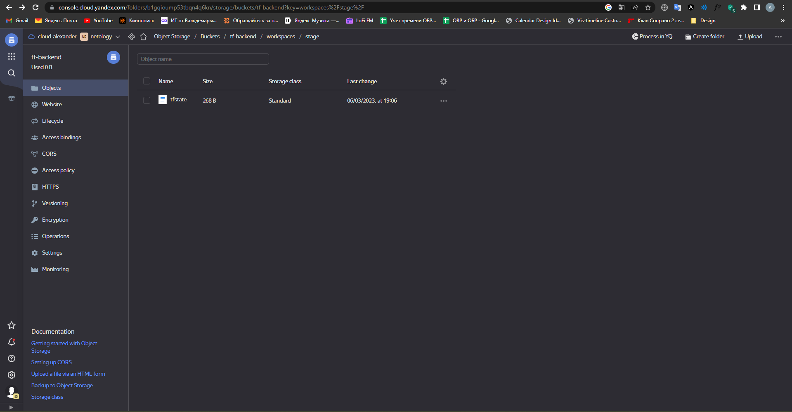
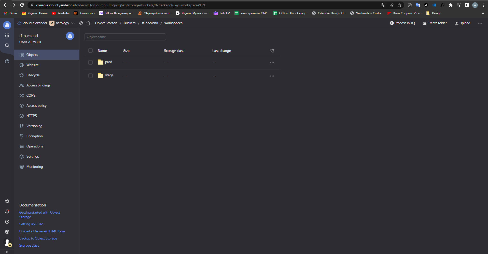
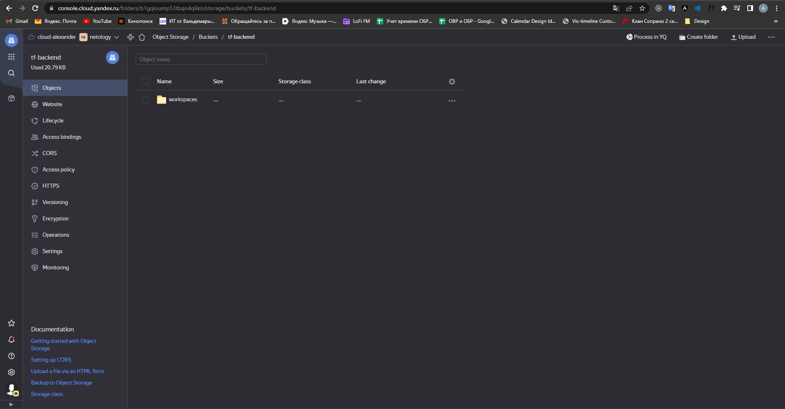
### 1.3. Networks & VMs
[конфигурация terraform](./terraform/config)

- provider.tf - Создание бэкенда в составе провайдера YC с указанием terraform_remote_state, для получения удаленного хранилища состояний terraform
- variables.tf - Переменные
- outputs.tf - Вывод необходимой информации
- network.tf - Сети
- private_subnets.tf - Подсети
- vms.tf - Виртуальные машины
- main.tf - Модуль конфигурации виртуальной машины

Инициализируем конфигурацию
```
aledcherry@aledcherry:~/devops-diplom-yandexcloud/src/terraform/config$ terraform init

Initializing the backend...

Successfully configured the backend "s3"! Terraform will automatically
use this backend unless the backend configuration changes.
Initializing modules...
- vm-for-each in modules/instance

Initializing provider plugins...
- terraform.io/builtin/terraform is built in to Terraform
- Finding latest version of yandex-cloud/yandex...
- Installing yandex-cloud/yandex v0.92.0...
- Installed yandex-cloud/yandex v0.92.0 (self-signed, key ID E40F590B50BB8E40)

Partner and community providers are signed by their developers.
If you'd like to know more about provider signing, you can read about it here:
https://www.terraform.io/docs/cli/plugins/signing.html

Terraform has created a lock file .terraform.lock.hcl to record the provider
selections it made above. Include this file in your version control repository
so that Terraform can guarantee to make the same selections by default when
you run "terraform init" in the future.

Terraform has been successfully initialized!

You may now begin working with Terraform. Try running "terraform plan" to see
any changes that are required for your infrastructure. All Terraform commands
should now work.

If you ever set or change modules or backend configuration for Terraform,
rerun this command to reinitialize your working directory. If you forget, other
commands will detect it and remind you to do so if necessary.
```

Рабочие окружения уже доступны для использования благодаря указанию terraform_remote_state
```
aledcherry@aledcherry:~/devops-diplom-yandexcloud/src/terraform/config$ terraform workspace list
* default
  prod
  stage
```
Переключимся на stage окружение
```
aledcherry@aledcherry:~/devops-diplom-yandexcloud/src/terraform/config$ terraform workspace select stage
Switched to workspace "stage".
```
Генерируем ssh пару для доступа к нодам:
```
ssh-keygen -t ed25519
```
Применяем конфигурацию
```
Apply complete! Resources: 7 added, 0 changed, 0 destroyed.

Outputs:

current-workspace-name = "stage"
network-id = "enpqk5jukbm0da80o2up"
remote_execution_determine = "Run environment: Local"
vpc-network-private-id = "enpqk5jukbm0da80o2up"
vpc-subnet-private1-id = "e9brdnd5rhqkg8aor6cm"
vpc-subnet-private1-zone = "ru-central1-a"
vpc-subnet-private2-id = "e2louk4vmf1mteeh9hc2"
vpc-subnet-private2-zone = "ru-central1-b"
vpc-subnet-private3-id = "b0cqcb9v5rlaegt1961n"
vpc-subnet-private3-zone = "ru-central1-c"
```

В результате получаем следующую инфраструктуру:

- 3 виртуальных машины
  - cp - мастер нода для кубера
  - node1 - воркер нода для кубера
  - node2 - воркер нода для кубера
- 3 подсети в разных зонах

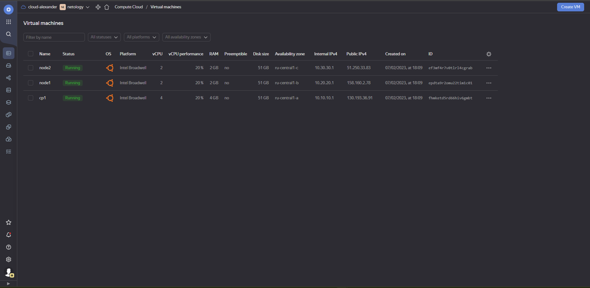
## Создание Kubernetes кластера

Для создания кластера воспользуемся kubespray

Клонируем репозиторий и устанавливаем нужные зависимости:
```
aledcherry@aledcherry:~/devops-diplom-yandexcloud/src$ wget https://github.com/kubernetes-sigs/kubespray/archive/refs/tags/v2.22.1.tar.gz
aledcherry@aledcherry:~/devops-diplom-yandexcloud/src$ tar -xvzf v2.22.1.tar.gz
aledcherry@aledcherry:~/devops-diplom-yandexcloud/src$ mv kubespray-2.22.1 kubespray
aledcherry@aledcherry:~/devops-diplom-yandexcloud/src$ sudo pip3 install -r kubespray/requirements.txt
```
Копируем пример конфигурации кластера:
```
aledcherry@aledcherry:~/devops-diplom-yandexcloud/src/kubespray$ cp -rfp inventory/sample inventory/mycluster
```

Kubespray позвляет развернуть не только production-ready кластер, но настроить что именно развернуть. Добавим несколько аддонов, чтобы kubespray установил их за нас(kubespray/inventroy/mycluster/group_vars/k8s_cluster/addons.yaml):
- helm_enabled: true - Деплой хелма

Также добавим настройки, чтобы была возможность управлять кластером с ansible машины(kubespray/inventroy/mycluster/group_vars/k8s_cluster/k8s_cluster.yaml:
- kubeconfig_localhost: true - для получения admin.conf на ansible машине
- supplementary_addresses_in_ssl_keys: [130.193.36.91] - для доступа в кластер извне по айпи
Включим ноды и получим публичные ip, затем запишем их в переменную, чтобы затем сформировать hosts.yaml файл:
```
aledcherry@aledcherry:~/devops-diplom-yandexcloud/src/kubespray/inventory$ declare -a IPS=(158.160.103.184 158.160.20.148 51.250.35.110)
aledcherry@aledcherry:~/devops-diplom-yandexcloud/src/kubespray$ CONFIG_FILE=inventory/mycluster/hosts.yaml python3 cont
rib/inventory_builder/inventory.py ${IPS[@]}
DEBUG: Adding group all
DEBUG: Adding group kube_control_plane
DEBUG: Adding group kube_node
DEBUG: Adding group etcd
DEBUG: Adding group k8s_cluster
DEBUG: Adding group calico_rr
DEBUG: adding host node1 to group all
DEBUG: adding host node2 to group all
DEBUG: adding host node3 to group all
DEBUG: adding host node1 to group etcd
DEBUG: adding host node2 to group etcd
DEBUG: adding host node3 to group etcd
DEBUG: adding host node1 to group kube_control_plane
DEBUG: adding host node2 to group kube_control_plane
DEBUG: adding host node1 to group kube_node
DEBUG: adding host node2 to group kube_node
DEBUG: adding host node3 to group kube_node
```
Получаем файл следующего вида:
```
aledcherry@aledcherry:~/devops-diplom-yandexcloud/src/kubespray/inventory/mycluster$ cat hosts.yaml
all:
  hosts:
    cp1:
      ansible_host: 130.193.36.91
      ansible_user: ubuntu
    node1:
      ansible_host: 158.160.2.78
      ansible_user: ubuntu
    node2:
      ansible_host: 51.250.33.83
      ansible_user: ubuntu
  children:
    kube_control_plane:
      hosts:
        cp1:
    kube_node:
      hosts:
        cp1:
        node1:
        node2:
    etcd:
      hosts:
        cp1:
        node1:
        node2:
    k8s_cluster:
      children:
        kube_control_plane:
        kube_node:
    calico_rr:
      hosts: {}
```

Запускаем плейбуки:
```
aledcherry@aledcherry:~/devops-diplom-yandexcloud/src/kubespray$ ansible-playbook -i inventory/mycluster/hosts.yaml cluster.yml
```

Результат:
```
PLAY RECAP ******************************************************************************************************************************************************************************************************
cp1                        : ok=836  changed=164  unreachable=0    failed=0    skipped=1300 rescued=0    ignored=8
localhost                  : ok=3    changed=0    unreachable=0    failed=0    skipped=0    rescued=0    ignored=0
node1                      : ok=569  changed=114  unreachable=0    failed=0    skipped=807  rescued=0    ignored=2
node2                      : ok=569  changed=114  unreachable=0    failed=0    skipped=807  rescued=0    ignored=2
```

admin.conf:
```
aledcherry@aledcherry:~/devops-diplom-yandexcloud/src/kubespray/inventory/mycluster/artifacts$ cat admin.conf
apiVersion: v1
clusters:
- cluster:
    certificate-authority-data: LS0tLS1CRUdJTiBDRVJUSUZJQ0FURS0tLS0tCk1JSUMvakNDQWVhZ0F3SUJBZ0lCQURBTkJna3Foa2lHOXcwQkFRc0ZBREFWTVJNd0VRWURWUVFERXdwcmRXSmwKY201bGRHVnpNQjRYRFRJek1EY3dNakUxTXpFMU1Gb1hEVE16TURZeU9URTFNekUxTUZvd0ZURVRNQkVHQTFVRQpBeE1LYTNWaVpYSnVaWFJsY3pDQ0FTSXdEUVlKS29aSWh2Y05BUUVCQlFBRGdnRVBBRENDQVFvQ2dnRUJBTGEyCllCOHp1aHo4N1lDaXJ5dzMzWVFYbDc0MVRtSUVraURNcUkwL2JTUzRUSzhsOXg5cXAyNmthSWNtVHgxSWNrbFgKVWY3K3k5OVNNYkl1OHZMSElscU1SMGpIazBUbVhGN0FNYitreUJFY2p6ZTVGL1lkcVNVUElEVWFsZWhVN2tRcAo1dFV0NytJRk84R3FBdk1nbnNNaDlnenpqUmhWTyt4eGkyTnFFTktwNWdnWUpNWENQNVRSNUlldU5jd09JU1h5CjIvWlAvSGh3UHdYQlJWSmVKSy9ZSjZTSXQzckVoc1RQTlJzM2VmTHZ0N2UwbXp3dGxUckJzMW1TNi9seUlwRm8KVExuV2szaDhQSmYrYnRlemRRcXF1RCtUeGdTQW9YQS9vdnA2V3RkNzV4ZTVNL1daWHlmSFlmb2hFUGMxYytIaApoc3lJVThkMWlOV0UwRDlRZ3RrQ0F3RUFBYU5aTUZjd0RnWURWUjBQQVFIL0JBUURBZ0trTUE4R0ExVWRFd0VCCi93UUZNQU1CQWY4d0hRWURWUjBPQkJZRUZDQVE2cTBhcTgvaFpSWHFNRGdSRmF2akJPMWZNQlVHQTFVZEVRUU8KTUF5Q0NtdDFZbVZ5Ym1WMFpYTXdEUVlKS29aSWh2Y05BUUVMQlFBRGdnRUJBRTYyWGlicnp4NlVid2xOc3hMVApxalBOakIxbXV0TFFrb0tNWFZxSEVBVTY3NjBNQmZvamVHY3RkT3Nmczh5VHVqQk5vY0JtcFRkdy85L2hBY1VQCnZKc0FKRElEMVI3RVZvaGc4WWJUcVRlOENIMWNzdUNQWXpEUUZrb0JuL0NURDFjdC9jMjJoRkttMTBJNFVDTjUKVzY3blErMkc2ejFFZFpCSzB0TGQrcWR3dUlZbUh0YUhqejRiOFhpSUJuUmROWHdWU3ErU3ptenlDalZyb3pZRQpoR1dqaWVJcDlUQVl6Nm9JaFI4T2xaUnhxMWp4Q1FFOEh3czBzSDZLcUpadDJBRW1hWUVhNFlpU1ZITUdHb3NpCnp0N2dlS2FvdmMvcTVOT0VvVWpTTnZIbTlaZjZkcXc3RDZCSmgyQThrRU1FVGtabEtXcWZIdXRIcnkvUFpERDkKbTdBPQotLS0tLUVORCBDRVJUSUZJQ0FURS0tLS0tCg==
    server: https://130.193.36.91:6443
  name: cluster.local
contexts:
- context:
    cluster: cluster.local
    user: kubernetes-admin-cluster.local
  name: kubernetes-admin-cluster.local@cluster.local
current-context: kubernetes-admin-cluster.local@cluster.local
kind: Config
preferences: {}
users:
- name: kubernetes-admin-cluster.local
  user:
    client-certificate-data: LS0tLS1CRUdJTiBDRVJUSUZJQ0FURS0tLS0tCk1JSURJVENDQWdtZ0F3SUJBZ0lJTFlyYVVGWnBiN2t3RFFZSktvWklodmNOQVFFTEJRQXdGVEVUTUJFR0ExVUUKQXhNS2EzVmlaWEp1WlhSbGN6QWVGdzB5TXpBM01ESXhOVE14TlRCYUZ3MHlOREEzTURFeE5UTXhOVEZhTURReApGekFWQmdOVkJBb1REbk41YzNSbGJUcHRZWE4wWlhKek1Sa3dGd1lEVlFRREV4QnJkV0psY201bGRHVnpMV0ZrCmJXbHVNSUlCSWpBTkJna3Foa2lHOXcwQkFRRUZBQU9DQVE4QU1JSUJDZ0tDQVFFQW5xbUhBeHY2dE9WcjI1M3UKOW5iN2ZwbzlVQkRvc3dJMWtrRHBjZWJpQmlpNWtMY0dVQ3ZocENEcE1hdGY1WDZHR3pHZjBnWmJwSXBZZEQrYgorQzg0cXNSOFV4dFZwcFZnQkg0MlEzVDZuZUR4QUJrQzZVMWJ1c2hFOWRkUHZoRllKSzlSTlZLRHVOSkV4ZkFpCmh3K2JSSjBaOXFFWmpVN3o5QldBT1NLaFVWWDFWMC85N1RiSjl4Tzl5WE1rV3pNZ0pybjZwWW5adTU0SE12Z1AKR1c5ZnJsN1RraXZMSEpwUXFQT2ZHYlhUUGdTcUtneTZhYWpEWEFlZXdJUW52a3pJTEhxS3RUbkVhSU9ZZjF2bgpsYk9iall2V25uT2FjdURma3pPekNiZmJ5QU5Ka1lpd3c3SjJPNWNGRTJjQS8vYzFNUXp3dmhjY1dtbHRiKytRCjJJU2oxUUlEQVFBQm8xWXdWREFPQmdOVkhROEJBZjhFQkFNQ0JhQXdFd1lEVlIwbEJBd3dDZ1lJS3dZQkJRVUgKQXdJd0RBWURWUjBUQVFIL0JBSXdBREFmQmdOVkhTTUVHREFXZ0JRZ0VPcXRHcXZQNFdVVjZqQTRFUldyNHdUdApYekFOQmdrcWhraUc5dzBCQVFzRkFBT0NBUUVBTy9ZM1RqS0VwNXhVL2syZUp4SjI5b2xsdE1EU0xFK2xYR05rCjJVRUZJVVpwZmY1U2hRY2xJT2xuc1dUTFQ0TlppVHloYmpQY3MwTm9QZjArU2pqd01OaTBHUGhiOStGTFVLYUwKb3ZzVnMydVRFTzhBTUdmOFdmUlBpR0xCMHVuUjRwT0MyRHllVkNaMTRjUXVVZ25LdVVLUUVkRE1tdi9qSm51WApkck9uWU1DcVlmdzE1S1hXNWl4QzN3UTdOc0IwUmhCVG5hWEZMcHhKUU9yMWJiODd0dm9uWHJLTmJpUnpYdUNCCmowV3EvU0pFdGNkWWFqL2ZlQzhRNU5mSlBDM1RoekVWSUp3QWZRVzdVY2R5TnJhMWRKSlpxS25WTmtwS0NQTWcKOVVBL1hIVzRYbjdjaTNLdU82M2JVNC94YUhjSUJuMEdSMjRva1I2WDVwakh6L21FQmc9PQotLS0tLUVORCBDRVJUSUZJQ0FURS0tLS0tCg==
    client-key-data: LS0tLS1CRUdJTiBSU0EgUFJJVkFURSBLRVktLS0tLQpNSUlFb3dJQkFBS0NBUUVBbnFtSEF4djZ0T1ZyMjUzdTluYjdmcG85VUJEb3N3STFra0RwY2ViaUJpaTVrTGNHClVDdmhwQ0RwTWF0ZjVYNkdHekdmMGdaYnBJcFlkRCtiK0M4NHFzUjhVeHRWcHBWZ0JINDJRM1Q2bmVEeEFCa0MKNlUxYnVzaEU5ZGRQdmhGWUpLOVJOVktEdU5KRXhmQWlodytiUkowWjlxRVpqVTd6OUJXQU9TS2hVVlgxVjAvOQo3VGJKOXhPOXlYTWtXek1nSnJuNnBZblp1NTRITXZnUEdXOWZybDdUa2l2TEhKcFFxUE9mR2JYVFBnU3FLZ3k2CmFhakRYQWVld0lRbnZreklMSHFLdFRuRWFJT1lmMXZubGJPYmpZdldubk9hY3VEZmt6T3pDYmZieUFOSmtZaXcKdzdKMk81Y0ZFMmNBLy9jMU1Rend2aGNjV21sdGIrK1EySVNqMVFJREFRQUJBb0lCQUQ0MFBNaU5TYWR1WXZFQgpaRlNncFUwbmIyNWFrc0RMMXZEMkhoQVg4dmx6TWYxNHBETCtZVUtWM0pjcWx6aEVlSk5reTBIdVdET1VRY1doCndxWjA3UVNXY0IrdEVkRnpzdWRRRERvNlBKOTFOMGRRaHdHczRJL0VRTFVacXh2YmRQRTlBdHVpOUIyYjRuYXcKQlBscXR2Y1ptTHBHd3R2UjNuY05qdTNYaytOczc4cXoyOEdqVlMyNlR0L2VIVm5zU04wZUpQNHIrUHZ6TnBUOApkUG5TNzRCTE9uOWp0YlF1dzlEN01VcGYrVDF3Mi9nYm1VeGtsWXpaZUZGZDVFS0NER3diWTBaekFZQlIrSUxXCnZGd1NsZjZJS2w3S3prWXUxUldOTTlrYjc1bk43WCtvTDhsa3JnbTdMYm5ZU3JpUFZ2WmUrNVB5UU5kcUcrVmUKN0hVaEljRUNnWUVBMHBSMlYvUSt6UGkweENMcmk0UnVOMUxHSDBVb1dabi9QR2ZqNi9LV000Nmo0U0NrTFZVQwp1aDduaWRoNDRYLzZrNzJzMHNtTUx0RVZIdzIvSjkvWW5iOWtCemd3TTVMdFBDTCtmRFd5RDNscGhEME0xV2c5ClU3d3RJWmZRVS9sSnJHRjZqL2hOcGlqT3NETTZCME1vOU5ieW1URkpzaWc4OEdKUDZTOHdCcmtDZ1lFQXdPSlcKaTQzNGY0c3QyWHlpTlFacStNdVgyb2xTSlRTNlo4dDNnMGFuQmZPcUxrSDJXOWZFbjJqQ1pCSGNBUTFPcm43SwpsRHRTcVlnSEhJaTR5YjVqY0JhNkdXRXlZRnZyWEVETEx6VTJ0aGZiMmY0eHAzQzdvQXE3b1JxMDdlQVdCWXgxCmc1aU9TVU9tcEFQTi82VzF1ZWlVamNMOE1mYzluTTFGa1VOZWQvMENnWUVBMFRZTXFXK1E0U1dLdW42VEUrYTcKZFoxNEZ1TW5wbldZSGhSOVhoS0NaYkNtWW1tQ2swTXRWV3FVME4vUG9RSDhHc0pNTEpOdkFhaGFXcUxXc3EvegpUeTR5Ry9ZWDlYVlkydkZOY213S2Z0TTZJTlppcExkT2pwMmJIUS91T3krbG9XeXJUdFA3bVVSYnJMVUlSdVRUCmtRVG91NGc3VnBRaGp4V3RuTmR6MklrQ2dZQUJGVVJISkZUdzRtY3ZnWE9udUpHQk5DTjJKcTgvWmp4bHVNN0MKL2ZLU0pmd2VwbUFydzlwbXlyL01zQXo4Tklic2srbXZTMlg3YmJnY2dPZ0l1ZmowK0N1eldNaGZvaVNBTUJ6ego5dWlIdlRxT3pzNllraGw3bkpQUkk4VkFVTEhPOWlyeXdqaUtVTWJ1eE5helNNcnNjRkhsT2VNUXBNTER6cU5GClhZdDZRUUtCZ0JkZ2pOZDgyUTY1SklVMXZRdjcrcVBCOGlNS0J6S3M1Vk5wakVKQ0NLMDRsRXRNWTlZL0pXVDUKelprOTlWU3BPZnBJRUxRMHpsVFJRQ1FGRDdJSXk3NEFkb3g5MEszRFFDeGtMU2pXT3NDc1g5b291NWRjbkJYcQp6OHB3Q0xZcHFEK2hJd3VUdW9FdTYvTmJtdWpJL3VHZElyRjFxZWlGdE90Q0ltaHNsRnhjCi0tLS0tRU5EIFJTQSBQUklWQVRFIEtFWS0tLS0tCg==
```

Получение подов:
```
aledcherry@aledcherry:~/devops-diplom-yandexcloud/src/kubespray/inventory/mycluster/artifacts$ ./kubectl.sh get pods -A
NAMESPACE     NAME                                      READY   STATUS    RESTARTS   AGE
kube-system   calico-kube-controllers-6dfcdfb99-w9sxc   1/1     Running   0          10m
kube-system   calico-node-d4tlx                         1/1     Running   0          11m
kube-system   calico-node-jsvd5                         1/1     Running   0          11m
kube-system   calico-node-z5llg                         1/1     Running   0          11m
kube-system   coredns-645b46f4b6-88mnw                  1/1     Running   0          9m59s
kube-system   coredns-645b46f4b6-wz9th                  1/1     Running   0          10m
kube-system   dns-autoscaler-659b8c48cb-v2hvd           1/1     Running   0          10m
kube-system   kube-apiserver-cp1                        1/1     Running   2          14m
kube-system   kube-controller-manager-cp1               1/1     Running   3          14m
kube-system   kube-proxy-h2c25                          1/1     Running   0          12m
kube-system   kube-proxy-qx9pz                          1/1     Running   0          12m
kube-system   kube-proxy-zxpk8                          1/1     Running   0          12m
kube-system   kube-scheduler-cp1                        1/1     Running   1          14m
kube-system   nginx-proxy-node1                         1/1     Running   0          11m
kube-system   nginx-proxy-node2                         1/1     Running   0          11m
kube-system   nodelocaldns-97fb5                        1/1     Running   0          9m58s
kube-system   nodelocaldns-lrt79                        1/1     Running   0          9m58s
kube-system   nodelocaldns-xcdzj                        1/1     Running   0          9m58s
```

## 3. Создание тестового приложения

Создадим простую html страничку, которая будет отображать текущее время клиента
```
<html>
<head>
    <meta http-equiv="Content-Type" content="text/html;charset=UTF-8">
    <title>Chernykh A.E.</title>
    <link rel="icon" type="image/x-icon" href="favicon.png">
    <style>
        h1 {display:block }
        body {display:flex; justify-content: center; align-items: center; height: 100vh; width: 100vw; }
    </style>
</head>
<body>
<h1 id="time"></h1>
</body>
<script>
    const time = new Date().toString();
    const el = document.getElementById('time');
    el.innerText = time;
</script>
</html>
```

И dockerfile для сборки образа
```
FROM nginx:stable-alpine
COPY index.html /usr/share/nginx/html
```

Собираем образ и пушим его в gitlab registry:
```
PS D:\Projects\web-app> docker build -t registry.gitlab.com/chernykhal/web-app:1.0.0 .
[+] Building 0.1s (7/7) FINISHED
 => [internal] load build definition from Dockerfile                                                                                                                             0.0s
840ea2691957: Layer already exists
50318282ffa9: Layer already exists
e9d24a183d90: Layer already exists
ed613eb504f4: Layer already exists
ec2b4937db9f: Layer already exists
1a3b419ee662: Layer already exists
3dab9f8bf2d2: Layer already exists
1.0.0: digest: sha256:25cee8608d551d8ba8170500bcb2ddf45c98d5f479d31e1e09b18b5cb71a4510 size: 1988
PS D:\Projects\web-app> docker push registry.gitlab.com/chernykhal/web-app:1.0.0
The push refers to repository [registry.gitlab.com/chernykhal/web-app]
```
Ссылка на образы в гитлабе - https://gitlab.com/chernykhal/web-app/container_registry/4356240
Таким образом получаем веб-приложение и инструкцию dockerfile, также сразу разместили его в одном из возможных реестров контейнеров
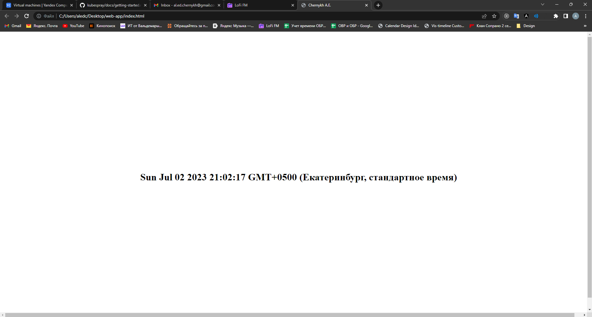
P.S. Посчитал выгрузить образ в гитлабовский реестр, так как мне кажется, что лучше образы будут лежать рядом с самим приложение, также в дальнейшем будет сделан CICD через гитлаб раннер

## 4. Подготовка cистемы мониторинга и деплой приложения

Подготовим манифесты пакета Kube-prometheus:

Данный пакет содержит набор инструментов для мониторинга кластера и приложений в нем:
- Prometheus - собирает метрики по HTTP протоколу.
- Prometheus Operator - отвечает за разворачивание приложений в кластере и контроль системы мониторинга.
- Prometheus Adapter for Kubernetes Metrics APIs - адаптер метрик;
- Prometheus Node Exporter - экспортер метрик хостовой ОС. Передает данные в Prometheus.
- kube-state-metrics - слушает сервер k8s API и генерирует метрики состояния его объектов.
- grafana - визуализирует данные.
- Alert-manager - отвечает за оповещения для Prometheus.

На машине должен быть установлен go для установки json-bundler:
```
aledcherry@aledcherry:/home$ go install -a github.com/jsonnet-bundler/jsonnet-bundler/cmd/jb@latest
go: downloading github.com/jsonnet-bundler/jsonnet-bundler v0.5.1
go: downloading github.com/fatih/color v1.13.0
go: downloading gopkg.in/alecthomas/kingpin.v2 v2.2.6
go: downloading github.com/pkg/errors v0.9.1
go: downloading github.com/mattn/go-isatty v0.0.14
go: downloading github.com/mattn/go-colorable v0.1.12
go: downloading github.com/alecthomas/template v0.0.0-20190718012654-fb15b899a751
go: downloading github.com/alecthomas/units v0.0.0-20211218093645-b94a6e3cc137
go: downloading golang.org/x/sys v0.0.0-20220615213510-4f61da869c0c
```
После переходим в папку kube-prometheus в проекте и инициализируем в ней json-bundler и устанавливаем зависимости kube-prometheus:
```
aledcherry@aledcherry:~/devops-diplom-yandexcloud/src/kube-prometheus$ jb init
aledcherry@aledcherry:~/devops-diplom-yandexcloud/src/kube-prometheus$ jb install github.com/prometheus-operator/kube-prometheus/jsonnet/kube-prometheus@main
GET https://github.com/prometheus-operator/kube-prometheus/archive/858a2a53f42720a8baa048de5984835deb59328d.tar.gz 200
GET https://github.com/pyrra-dev/pyrra/archive/0cc188220949f081ce85f97894ca90c0b24861df.tar.gz 200
GET https://github.com/thanos-io/thanos/archive/37cf55964d88c2afd305e635e8dd0045826610db.tar.gz 200
GET https://github.com/prometheus-operator/prometheus-operator/archive/5457c5c34c034316dc982d6b882bb4a77ae34002.tar.gz 200
GET https://github.com/kubernetes-monitoring/kubernetes-mixin/archive/003ba5eadfbd69817d1215952133d3ecf99fbd92.tar.gz 200
GET https://github.com/kubernetes/kube-state-metrics/archive/bb6e9f42f8bac32ed6e50b6932cb2ab7fc9307ef.tar.gz 200
GET https://github.com/prometheus/node_exporter/archive/c31ebb43590cb0055acd4bc00a432f6a2dafdd08.tar.gz 200
GET https://github.com/kubernetes/kube-state-metrics/archive/bb6e9f42f8bac32ed6e50b6932cb2ab7fc9307ef.tar.gz 200
GET https://github.com/prometheus/prometheus/archive/031d22df9e43f1c3014b8344337e133099902ae8.tar.gz 200
GET https://github.com/prometheus/alertmanager/archive/11e0edb1d2d21e80325a64a4a14ec088d521aea6.tar.gz 200
GET https://github.com/brancz/kubernetes-grafana/archive/5698c8940b6dadca3f42107b7839557bc041761f.tar.gz 200
GET https://github.com/grafana/grafana/archive/1120f9e255760a3c104b57871fcb91801e934382.tar.gz 200
GET https://github.com/etcd-io/etcd/archive/57a583d14021c3f2ffd25ceae6993a28a3a0a691.tar.gz 200
GET https://github.com/prometheus-operator/prometheus-operator/archive/5457c5c34c034316dc982d6b882bb4a77ae34002.tar.gz 200
GET https://github.com/grafana/grafonnet-lib/archive/a1d61cce1da59c71409b99b5c7568511fec661ea.tar.gz 200
GET https://github.com/grafana/jsonnet-libs/archive/6621ddc23751d828e9d4b78fda38c1fa3f6bdc84.tar.gz 200
GET https://github.com/grafana/grafonnet-lib/archive/a1d61cce1da59c71409b99b5c7568511fec661ea.tar.gz 200
```

Скачаем образец конфигурации example.jsonet:
```
aledcherry@aledcherry:~/devops-diplom-yandexcloud/src/kube-prometheus$ wget https://raw.githubusercontent.com/prometheus-operator/kube-prometheus/main/example.jsonnet -O example.jsonnet
--2023-07-02 23:19:14--  https://raw.githubusercontent.com/prometheus-operator/kube-prometheus/main/example.jsonnet
Resolving raw.githubusercontent.com (raw.githubusercontent.com)... 185.199.108.133, 185.199.109.133, 185.199.110.133, ...
Connecting to raw.githubusercontent.com (raw.githubusercontent.com)|185.199.108.133|:443... connected.
HTTP request sent, awaiting response... 200 OK
Length: 2273 (2.2K) [text/plain]
Saving to: ‘example.jsonnet’

example.jsonnet           100%[===================================>]   2.22K  --.-KB/s    in 0s

2023-07-02 23:19:14 (42.3 MB/s) - ‘example.jsonnet’ saved [2273/2273]
```

И скрипт для сборки:
```
aledcherry@aledcherry:~/devops-diplom-yandexcloud/src/kube-prometheus$ wget https://raw.githubusercontent.com/prometheus-operator/kube-prometheus/main/build.sh -O build.sh
--2023-07-02 23:20:05--  https://raw.githubusercontent.com/prometheus-operator/kube-prometheus/main/build.sh
Resolving raw.githubusercontent.com (raw.githubusercontent.com)... 185.199.108.133, 185.199.109.133, 185.199.110.133, ...
Connecting to raw.githubusercontent.com (raw.githubusercontent.com)|185.199.108.133|:443... connected.
HTTP request sent, awaiting response... 200 OK
Length: 679 [text/plain]
Saving to: ‘build.sh’

build.sh                  100%[===================================>]     679  --.-KB/s    in 0s

2023-07-02 23:20:06 (70.9 MB/s) - ‘build.sh’ saved [679/679]
```

Обновим зависимости kube-prometheus:
```
aledcherry@aledcherry:~/devops-diplom-yandexcloud/src/kube-prometheus$ jb update
GET https://github.com/prometheus-operator/kube-prometheus/archive/858a2a53f42720a8baa048de5984835deb59328d.tar.gz 200
GET https://github.com/prometheus-operator/prometheus-operator/archive/5457c5c34c034316dc982d6b882bb4a77ae34002.tar.gz 200
GET https://github.com/prometheus-operator/prometheus-operator/archive/5457c5c34c034316dc982d6b882bb4a77ae34002.tar.gz 200
GET https://github.com/prometheus/node_exporter/archive/c31ebb43590cb0055acd4bc00a432f6a2dafdd08.tar.gz 200
GET https://github.com/prometheus/prometheus/archive/031d22df9e43f1c3014b8344337e133099902ae8.tar.gz 200
GET https://github.com/prometheus/alertmanager/archive/11e0edb1d2d21e80325a64a4a14ec088d521aea6.tar.gz 200
GET https://github.com/pyrra-dev/pyrra/archive/0cc188220949f081ce85f97894ca90c0b24861df.tar.gz 200
GET https://github.com/thanos-io/thanos/archive/37cf55964d88c2afd305e635e8dd0045826610db.tar.gz 200
GET https://github.com/brancz/kubernetes-grafana/archive/5698c8940b6dadca3f42107b7839557bc041761f.tar.gz 200
GET https://github.com/grafana/grafana/archive/1120f9e255760a3c104b57871fcb91801e934382.tar.gz 200
GET https://github.com/etcd-io/etcd/archive/57a583d14021c3f2ffd25ceae6993a28a3a0a691.tar.gz 200
GET https://github.com/kubernetes-monitoring/kubernetes-mixin/archive/003ba5eadfbd69817d1215952133d3ecf99fbd92.tar.gz 200
GET https://github.com/kubernetes/kube-state-metrics/archive/bb6e9f42f8bac32ed6e50b6932cb2ab7fc9307ef.tar.gz 200
GET https://github.com/kubernetes/kube-state-metrics/archive/bb6e9f42f8bac32ed6e50b6932cb2ab7fc9307ef.tar.gz 200
GET https://github.com/grafana/grafonnet-lib/archive/a1d61cce1da59c71409b99b5c7568511fec661ea.tar.gz 200
GET https://github.com/grafana/jsonnet-libs/archive/6621ddc23751d828e9d4b78fda38c1fa3f6bdc84.tar.gz 200
GET https://github.com/grafana/grafonnet-lib/archive/a1d61cce1da59c71409b99b5c7568511fec661ea.tar.gz 200
```

Дополнительно установим необходимые инструменты gojsontoyaml и jsonnet
```
aledcherry@aledcherry:~/devops-diplom-yandexcloud/src/kube-prometheus$ go install github.com/brancz/gojsontoyaml@latest
go: downloading github.com/brancz/gojsontoyaml v0.1.0
go: downloading gopkg.in/yaml.v2 v2.4.0
go: downloading github.com/ghodss/yaml v1.0.0
aledcherry@aledcherry:~/devops-diplom-yandexcloud/src/kube-prometheus$ go install github.com/google/go-jsonnet/cmd/jsonnet@latest
go: downloading github.com/google/go-jsonnet v0.20.0
go: downloading github.com/fatih/color v1.12.0
go: downloading sigs.k8s.io/yaml v1.1.0
go: downloading github.com/mattn/go-isatty v0.0.12
go: downloading github.com/mattn/go-colorable v0.1.8
go: downloading golang.org/x/sys v0.1.0
go: downloading gopkg.in/yaml.v2 v2.2.7
```
Создадим собственную конфигурацию monitoring.jsonnet, скопировав из примера и запустим скрипт генерации манифестов:
```
aledcherry@aledcherry:~/devops-diplom-yandexcloud/src/kube-prometheus$ ./build.sh monitoring.jsonnet
+ set -o pipefail
++ pwd
+ PATH='/home/aledcherry/devops-diplom-yandexcloud/src/kube-prometheus/tmp/bin:/home/aledcherry/yandex-cloud/bin:/usr/local/sbin:/usr/local/bin:/usr/sbin:/usr/bin:/sbin:/bin:/usr/games:/usr/local/games:/usr/lib/wsl/lib:/mnt/c/Program Files (x86)/Common Files/Oracle/Java/javapath:/mnt/c/Windows/system32:/mnt/c/Windows:/mnt/c/Windows/System32/Wbem:/mnt/c/Windows/System32/WindowsPowerShell/v1.0/:/mnt/c/Windows/System32/OpenSSH/:/mnt/c/Program Files (x86)/NVIDIA Corporation/PhysX/Common:/mnt/c/Program Files/dotnet/:/mnt/d/Programs/nodejs/:/mnt/c/Program Files/Docker/Docker/resources/bin:/mnt/c/Users/aledc/Downloads/sonar-scanner-cli-4.7.0.2747-windows/sonar-scanner-4.7.0.2747-windows/bin:/mnt/c/Program Files/NVIDIA Corporation/NVIDIA NvDLISR:/mnt/d/Programs/Minikube:/mnt/c/ProgramData/chocolatey/bin:/mnt/d/Programs/Git/cmd:/mnt/c/Users/aledc/AppData/Local/Microsoft/WindowsApps:/mnt/c/Users/aledc/AppData/Roaming/npm:/mnt/d/Programs/WebStorm 2022.3/bin:/mnt/d/Programs/terraform:/mnt/c/Users/aledc/yandex-cloud/bin:/snap/bin:/usr/local/go/bin:/usr/local/go/bin:/home/aledcherry/go/bin'
+ rm -rf manifests
+ mkdir -p manifests/setup
+ jsonnet -J vendor -m manifests monitoring.jsonnet
+ xargs '-I{}' sh -c 'cat {} | gojsontoyaml > {}.yaml' -- '{}'
+ find manifests -type f '!' -name '*.yaml' -delete
+ rm -f kustomization
```
В папке manifests сгенерировался набор манифестов для развораивания системы мониторинга. Применим их:
```
aledcherry@aledcherry:~/devops-diplom-yandexcloud/src/kube-prometheus$ kubectl apply --server-side -f manifests/setup
namespace/monitoring serverside-applied
customresourcedefinition.apiextensions.k8s.io/alertmanagerconfigs.monitoring.coreos.com serverside-applied
customresourcedefinition.apiextensions.k8s.io/alertmanagers.monitoring.coreos.com serverside-applied
customresourcedefinition.apiextensions.k8s.io/podmonitors.monitoring.coreos.com serverside-applied
customresourcedefinition.apiextensions.k8s.io/probes.monitoring.coreos.com serverside-applied
customresourcedefinition.apiextensions.k8s.io/prometheuses.monitoring.coreos.com serverside-applied
customresourcedefinition.apiextensions.k8s.io/prometheusagents.monitoring.coreos.com serverside-applied
customresourcedefinition.apiextensions.k8s.io/prometheusrules.monitoring.coreos.com serverside-applied
customresourcedefinition.apiextensions.k8s.io/scrapeconfigs.monitoring.coreos.com serverside-applied
customresourcedefinition.apiextensions.k8s.io/servicemonitors.monitoring.coreos.com serverside-applied
customresourcedefinition.apiextensions.k8s.io/thanosrulers.monitoring.coreos.com serverside-applied
clusterrole.rbac.authorization.k8s.io/prometheus-operator serverside-applied
clusterrolebinding.rbac.authorization.k8s.io/prometheus-operator serverside-applied
deployment.apps/prometheus-operator serverside-applied
networkpolicy.networking.k8s.io/prometheus-operator serverside-applied
service/prometheus-operator serverside-applied
serviceaccount/prometheus-operator serverside-applied

aledcherry@aledcherry:~/devops-diplom-yandexcloud/src/kube-prometheus$ kubectl apply -f manifests
alertmanager.monitoring.coreos.com/main created
networkpolicy.networking.k8s.io/alertmanager-main created
poddisruptionbudget.policy/alertmanager-main created
prometheusrule.monitoring.coreos.com/alertmanager-main-rules created
secret/alertmanager-main created
service/alertmanager-main created
serviceaccount/alertmanager-main created
servicemonitor.monitoring.coreos.com/alertmanager-main created
clusterrole.rbac.authorization.k8s.io/blackbox-exporter created
clusterrolebinding.rbac.authorization.k8s.io/blackbox-exporter created
configmap/blackbox-exporter-configuration created
deployment.apps/blackbox-exporter created
networkpolicy.networking.k8s.io/blackbox-exporter created
service/blackbox-exporter created
serviceaccount/blackbox-exporter created
servicemonitor.monitoring.coreos.com/blackbox-exporter created
secret/grafana-config created
secret/grafana-datasources created
configmap/grafana-dashboard-alertmanager-overview created
configmap/grafana-dashboard-apiserver created
configmap/grafana-dashboard-cluster-total created
configmap/grafana-dashboard-controller-manager created
configmap/grafana-dashboard-grafana-overview created
configmap/grafana-dashboard-k8s-resources-cluster created
configmap/grafana-dashboard-k8s-resources-multicluster created
configmap/grafana-dashboard-k8s-resources-namespace created
configmap/grafana-dashboard-k8s-resources-node created
configmap/grafana-dashboard-k8s-resources-pod created
configmap/grafana-dashboard-k8s-resources-workload created
configmap/grafana-dashboard-k8s-resources-workloads-namespace created
configmap/grafana-dashboard-kubelet created
configmap/grafana-dashboard-namespace-by-pod created
configmap/grafana-dashboard-namespace-by-workload created
configmap/grafana-dashboard-node-cluster-rsrc-use created
configmap/grafana-dashboard-node-rsrc-use created
configmap/grafana-dashboard-nodes-darwin created
configmap/grafana-dashboard-nodes created
configmap/grafana-dashboard-persistentvolumesusage created
configmap/grafana-dashboard-pod-total created
configmap/grafana-dashboard-prometheus-remote-write created
configmap/grafana-dashboard-prometheus created
configmap/grafana-dashboard-proxy created
configmap/grafana-dashboard-scheduler created
configmap/grafana-dashboard-workload-total created
configmap/grafana-dashboards created
deployment.apps/grafana created
networkpolicy.networking.k8s.io/grafana created
prometheusrule.monitoring.coreos.com/grafana-rules created
service/grafana created
serviceaccount/grafana created
servicemonitor.monitoring.coreos.com/grafana created
prometheusrule.monitoring.coreos.com/kube-prometheus-rules created
clusterrole.rbac.authorization.k8s.io/kube-state-metrics created
clusterrolebinding.rbac.authorization.k8s.io/kube-state-metrics created
deployment.apps/kube-state-metrics created
networkpolicy.networking.k8s.io/kube-state-metrics created
prometheusrule.monitoring.coreos.com/kube-state-metrics-rules created
service/kube-state-metrics created
serviceaccount/kube-state-metrics created
servicemonitor.monitoring.coreos.com/kube-state-metrics created
prometheusrule.monitoring.coreos.com/kubernetes-monitoring-rules created
servicemonitor.monitoring.coreos.com/kube-apiserver created
servicemonitor.monitoring.coreos.com/coredns created
servicemonitor.monitoring.coreos.com/kube-controller-manager created
servicemonitor.monitoring.coreos.com/kube-scheduler created
servicemonitor.monitoring.coreos.com/kubelet created
clusterrole.rbac.authorization.k8s.io/node-exporter created
clusterrolebinding.rbac.authorization.k8s.io/node-exporter created
daemonset.apps/node-exporter created
networkpolicy.networking.k8s.io/node-exporter created
prometheusrule.monitoring.coreos.com/node-exporter-rules created
service/node-exporter created
serviceaccount/node-exporter created
servicemonitor.monitoring.coreos.com/node-exporter created
apiservice.apiregistration.k8s.io/v1beta1.metrics.k8s.io created
clusterrole.rbac.authorization.k8s.io/prometheus-adapter created
clusterrole.rbac.authorization.k8s.io/system:aggregated-metrics-reader created
clusterrolebinding.rbac.authorization.k8s.io/prometheus-adapter created
clusterrolebinding.rbac.authorization.k8s.io/resource-metrics:system:auth-delegator created
clusterrole.rbac.authorization.k8s.io/resource-metrics-server-resources created
configmap/adapter-config created
deployment.apps/prometheus-adapter created
networkpolicy.networking.k8s.io/prometheus-adapter created
poddisruptionbudget.policy/prometheus-adapter created
rolebinding.rbac.authorization.k8s.io/resource-metrics-auth-reader created
service/prometheus-adapter created
serviceaccount/prometheus-adapter created
servicemonitor.monitoring.coreos.com/prometheus-adapter created
clusterrole.rbac.authorization.k8s.io/prometheus-k8s created
clusterrolebinding.rbac.authorization.k8s.io/prometheus-k8s created
networkpolicy.networking.k8s.io/prometheus-k8s created
prometheusrule.monitoring.coreos.com/prometheus-operator-rules created
servicemonitor.monitoring.coreos.com/prometheus-operator created
poddisruptionbudget.policy/prometheus-k8s created
prometheus.monitoring.coreos.com/k8s created
prometheusrule.monitoring.coreos.com/prometheus-k8s-prometheus-rules created
rolebinding.rbac.authorization.k8s.io/prometheus-k8s-config created
rolebinding.rbac.authorization.k8s.io/prometheus-k8s created
rolebinding.rbac.authorization.k8s.io/prometheus-k8s created
rolebinding.rbac.authorization.k8s.io/prometheus-k8s created
role.rbac.authorization.k8s.io/prometheus-k8s-config created
role.rbac.authorization.k8s.io/prometheus-k8s created
role.rbac.authorization.k8s.io/prometheus-k8s created
role.rbac.authorization.k8s.io/prometheus-k8s created
service/prometheus-k8s created
serviceaccount/prometheus-k8s created
servicemonitor.monitoring.coreos.com/prometheus-k8s created
```

Для доступа к сервисам извне можно воспользоваться несколькими вариантами:
- пробросить порты в локальном окружении
- создать сервис LB по одному IP через любой желаемый порт
- на уровне облака сделать балансировку
- создать сервер NodePort, чтобы получить доступ по одному порту любой ноды

Воспользуемся 1 способом:

Получим список сервисов:
```
aledcherry@aledcherry:~/devops-diplom-yandexcloud/src/kube-prometheus$ kubectl get svc -n monitoring
NAME                    TYPE        CLUSTER-IP     EXTERNAL-IP   PORT(S)                      AGE
alertmanager-main       ClusterIP   10.233.58.92   <none>        9093/TCP,8080/TCP            3m59s
alertmanager-operated   ClusterIP   None           <none>        9093/TCP,9094/TCP,9094/UDP   3m59s
blackbox-exporter       ClusterIP   10.233.8.250   <none>        9115/TCP,19115/TCP           3m58s
grafana                 ClusterIP   10.233.12.53   <none>        3000/TCP                     3m54s
kube-state-metrics      ClusterIP   None           <none>        8443/TCP,9443/TCP            3m53s
node-exporter           ClusterIP   None           <none>        9100/TCP                     3m51s
prometheus-adapter      ClusterIP   10.233.11.2    <none>        443/TCP                      3m50s
prometheus-k8s          ClusterIP   10.233.50.76   <none>        9090/TCP,8080/TCP            3m48s
prometheus-operated     ClusterIP   None           <none>        9090/TCP                     3m48s
prometheus-operator     ClusterIP   None           <none>        8443/TCP                     4m10s
```
Пробросим порты в локальное окружение:
```
aledcherry@aledcherry:~/devops-diplom-yandexcloud/src/kube-prometheus$ kubectl --namespace monitoring port-forward svc/prometheus-k8s 9090
Forwarding from 127.0.0.1:9090 -> 9090
Forwarding from [::1]:9090 -> 9090
```
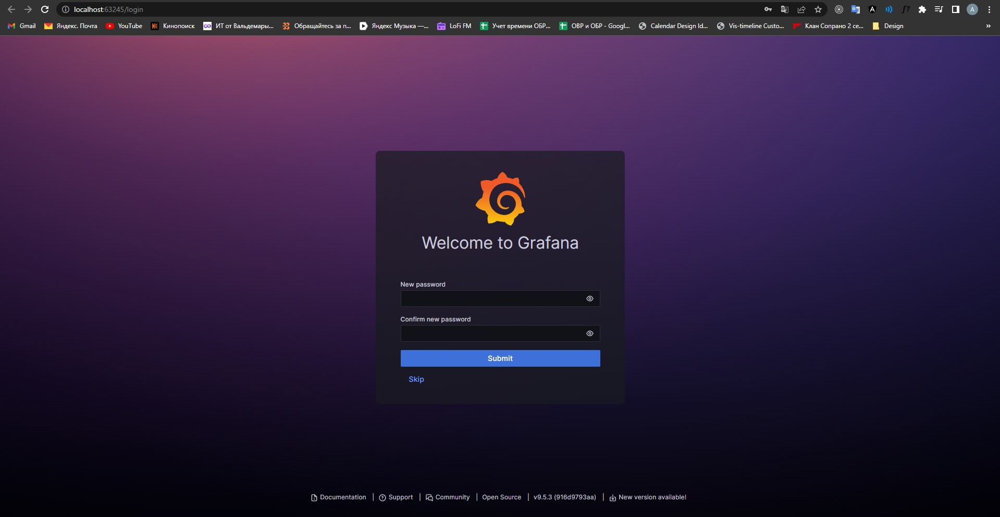
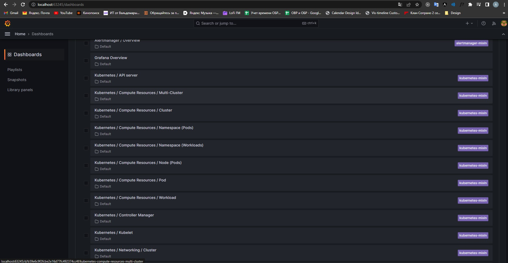
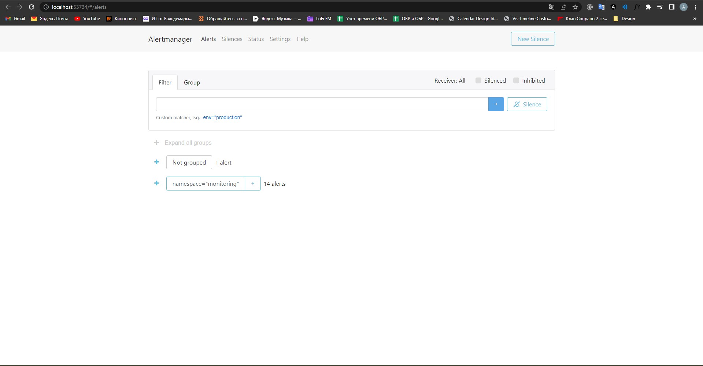
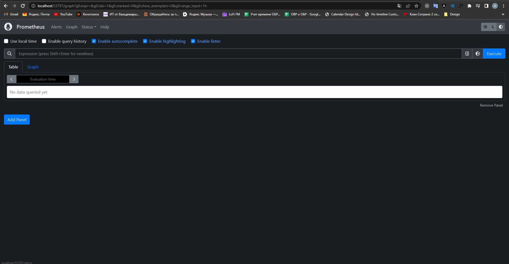
### Разворачивание приложения в кластере

Создадим директорию helm и заготовку чартов нашего веб-приложения
```
aledcherry@aledcherry:~/devops-diplom-yandexcloud/src$ mkdir helm
aledcherry@aledcherry:~/devops-diplom-yandexcloud/src$ cd helm
aledcherry@aledcherry:~/devops-diplom-yandexcloud/src/helm$ helm create web-app
Creating web-app
```
Почистим избыточные файлы, которые бессмысленно делать для простой html страницы. И создадим конфиги, объекты которых мы хотим развернуть в кластере. В нашем случае нужен только deployment и service:

```
---
apiVersion: apps/v1
kind: Deployment
metadata:
  name: web-app
  namespace: {{ include "ns" . }}
  labels:
    app: web-app
    component: frontend
spec:
  replicas: 2
  selector:
    matchLabels:
      app: web-app
      component: frontend
  template:
    metadata:
      labels:
        app: web-app
        component: frontend
    spec:
      containers:
      - name: diploma
        image: "{{- .Values.image.repository }}:{{ .Values.image.tag | default .Chart.AppVersion }}"
        ports:
        - name: frontend-port
          containerPort: 80
          protocol: TCP
---
apiVersion: v1
kind: Service
metadata:
  name: frontend-nodeport-svc
  namespace: {{ include "ns" . }}
  labels:
    app: web-app
    component: frontend
spec:
  type: NodePort
  selector:
    app: web-app
    component: frontend
  ports:
  - name: frontend-nodeport
    protocol: TCP
    nodePort: {{ include "frontend-port" . }}
    port: 80
    targetPort: frontend-port
```
В файле деплоимента шаблонизированны параметры, параметры находятся в файле values и helpers.tpl, содержит только источник репозитория, namespace и frontend-port:
values.yaml:
```
image:
  repository: registry.gitlab.com/chernykhal/web-app
  pullPolicy: IfNotPresent
  tag: ""
```
Тег образа содержится в файле Chart.yaml(appVersion: "1.0.0")

helpers.tpl:
```
{{/*
Returns name of applied namespace.
*/}}
{{- define "ns" -}}
{{- default .Release.Namespace .Values.currentNamespace }}
{{- end }}

{{/*
Returns frontend port number.
*/}}
{{- define "frontend-port" -}}
{{- "30000" }}
{{- end }}
```
Файл NOTES.txt, при запуске чарта будет выводиться сообщение из этого файла:
```
Welcome to "{{ .Release.Name }}" ({{ .Chart.Description }}) version "{{ .Chart.AppVersion }}" for namespace "{{ .Release.Namespace }}",
for current namespace "{{ .Values.currentNamespace }}",
proudly build from repository "{{ .Values.image.repository }}".

Release revision: {{ .Release.Revision }}

This is installation: {{ .Release.IsInstall }}
This is upgrade: {{ .Release.IsUpgrade }}
```
Приложение готово. Развернем его:
```
aledcherry@aledcherry:~/devops-diplom-yandexcloud/src/helm$ helm install web-app web-app
NAME: web-app
LAST DEPLOYED: Tue Jul  4 21:01:47 2023
NAMESPACE: default
STATUS: deployed
REVISION: 1
TEST SUITE: None
NOTES:
Welcome to "web-app" (A Helm chart for Kubernetes) version "1.0.0" for namespace "default",
for current namespace "",
proudly build from repository "registry.gitlab.com/chernykhal/web-app".

Release revision: 1

This is installation: true
This is upgrade: false
```
Приложение развернуто и доступно на любом ip ноды с портом 30000:

- http://130.193.36.91:30000/
- http://158.160.2.78:30000/
- http://51.250.33.83:30000/

Список развернутых ресурсов:
```
aledcherry@aledcherry:~/devops-diplom-yandexcloud/src/helm$ kubectl get all -n default
NAME                           READY   STATUS    RESTARTS   AGE
pod/web-app-64cc859c84-8wlrw   1/1     Running   0          2m34s
pod/web-app-64cc859c84-xss9f   1/1     Running   0          2m34s

NAME                            TYPE        CLUSTER-IP    EXTERNAL-IP   PORT(S)        AGE
service/frontend-nodeport-svc   NodePort    10.233.3.96   <none>        80:30000/TCP   2m35s
service/kubernetes              ClusterIP   10.233.0.1    <none>        443/TCP        2d

NAME                      READY   UP-TO-DATE   AVAILABLE   AGE
deployment.apps/web-app   2/2     2            2           2m35s

NAME                                 DESIRED   CURRENT   READY   AGE
replicaset.apps/web-app-64cc859c84   2         2         2       2m35s
```

## Установка и настройка CI/CD
Для этого воспользуемся возможностями gitlab.

Сперва необходимо установить gitlab-agent:
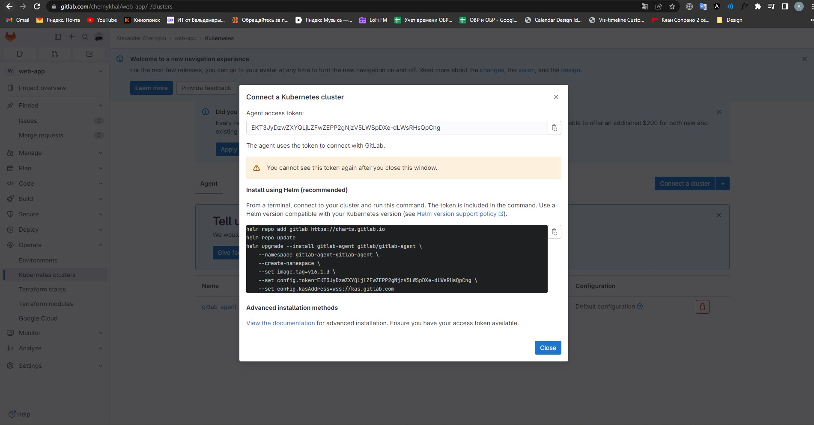
```
aledcherry@aledcherry:~/devops-diplom-yandexcloud/src$ helm repo add gitlab https://charts.gitlab.io
"gitlab" has been added to your repositories
aledcherry@aledcherry:~/devops-diplom-yandexcloud/src$ helm repo update
Hang tight while we grab the latest from your chart repositories...
...Successfully got an update from the "gitlab" chart repository
Update Complete. ⎈Happy Helming!⎈
aledcherry@aledcherry:~/devops-diplom-yandexcloud/src$ helm upgrade --install gitlab-agent gitlab/gitlab-agent \
    --namespace gitlab-agent-gitlab-agent \
    --create-namespace \
    --set image.tag=v16.1.3 \
    --set config.token=EKT3JyDzwZXYQLjLZFwZEPP2gNjzV5LWSpDXe-dLWsRHsQpCng \
    --set config.kasAddress=wss://kas.gitlab.com
Release "gitlab-agent" does not exist. Installing it now.
NAME: gitlab-agent
LAST DEPLOYED: Tue Jul  4 21:48:57 2023
NAMESPACE: gitlab-agent-gitlab-agent
STATUS: deployed
REVISION: 1
TEST SUITE: None
```
Gitlab-agent успешно зарегистрирован

Теперь необходимо зарегистрировать сам gitlab-runner. Для этого необходимо войти в раздел CI/CD настроек проекта. Там найти вкладку Runners и в уже в этой вкладке создать нового раннера.


После регистрации раннера нам предоставят токен. Этот токен понадобится для регистрации раннера в кластере.
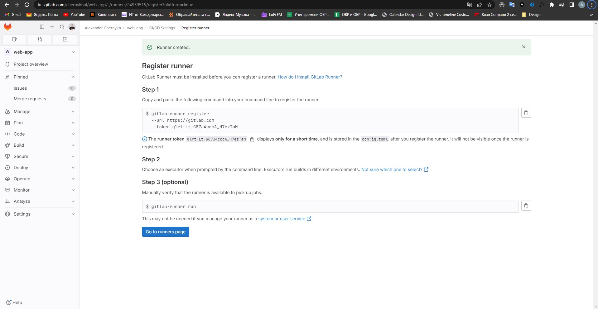

Для регистрации создаем файл gitlab/runner-chart-values.yaml:
```
l
# The GitLab Server URL (with protocol) that you want to register the runner against
# ref: https://docs.gitlab.com/runner/commands/index.html#gitlab-runner-register
#
gitlabUrl: https://gitlab.com/

# The registration token for adding new runners to the GitLab server
# Retrieve this value from your GitLab instance
# For more info: https://docs.gitlab.com/ee/ci/runners/index.html
#
runnerRegistrationToken: "glrt-UdRXHb5HSAXynkWbX21Q"

# For RBAC support:
rbac:
    create: true

# Run all containers with the privileged flag enabled
# This flag allows the docker:dind image to run if you need to run Docker commands
# Read the docs before turning this on:
# https://docs.gitlab.com/runner/executors/kubernetes.html#using-dockerdind
runners:
    privileged: true
    executor: kubernetes
```
После необходимо сгенерировать конфигурацию для кластера:
```
helm template --namespace gitlab gitlab-runner -f runner-chart-values.yaml gitlab/gitlab-runner > runner-manifest.ya
ml
```
Появится файл runner-manifest.yaml:
```
---
apiVersion: v1
kind: Namespace
metadata:
  name: gitlab
---
# Source: gitlab-runner/templates/service-account.yaml
apiVersion: v1
kind: ServiceAccount
metadata:
  name: gitlab-runner
  namespace: "gitlab"
  labels:
    app: gitlab-runner
    chart: gitlab-runner-0.54.0
    release: "gitlab-runner"
    heritage: "Helm"
---
# Source: gitlab-runner/templates/secrets.yaml
apiVersion: v1
kind: Secret
metadata:
  name: "gitlab-runner"
  namespace: "gitlab"
  labels:
    app: gitlab-runner
    chart: gitlab-runner-0.54.0
    release: "gitlab-runner"
    heritage: "Helm"
type: Opaque
data:
  runner-registration-token: "Z2xydC1VZFJYSGI1SFNBWHlua1diWDIxUQ=="
  runner-token: ""
---
# Source: gitlab-runner/templates/configmap.yaml
apiVersion: v1
kind: ConfigMap
metadata:
  name: gitlab-runner
  namespace: "gitlab"
  labels:
    app: gitlab-runner
    chart: gitlab-runner-0.54.0
    release: "gitlab-runner"
    heritage: "Helm"
data:
  entrypoint: |
    #!/bin/bash
    set -e

    mkdir -p /home/gitlab-runner/.gitlab-runner/

    cp /configmaps/config.toml /home/gitlab-runner/.gitlab-runner/

    # Set up environment variables for cache
    if [[ -f /secrets/accesskey && -f /secrets/secretkey ]]; then
      export CACHE_S3_ACCESS_KEY=$(cat /secrets/accesskey)
      export CACHE_S3_SECRET_KEY=$(cat /secrets/secretkey)
    fi

    if [[ -f /secrets/gcs-applicaton-credentials-file ]]; then
      export GOOGLE_APPLICATION_CREDENTIALS="/secrets/gcs-applicaton-credentials-file"
    elif [[ -f /secrets/gcs-application-credentials-file ]]; then
      export GOOGLE_APPLICATION_CREDENTIALS="/secrets/gcs-application-credentials-file"
    else
      if [[ -f /secrets/gcs-access-id && -f /secrets/gcs-private-key ]]; then
        export CACHE_GCS_ACCESS_ID=$(cat /secrets/gcs-access-id)
        # echo -e used to make private key multiline (in google json auth key private key is oneline with \n)
        export CACHE_GCS_PRIVATE_KEY=$(echo -e $(cat /secrets/gcs-private-key))
      fi
    fi

    if [[ -f /secrets/azure-account-name && -f /secrets/azure-account-key ]]; then
      export CACHE_AZURE_ACCOUNT_NAME=$(cat /secrets/azure-account-name)
      export CACHE_AZURE_ACCOUNT_KEY=$(cat /secrets/azure-account-key)
    fi

    if [[ -f /secrets/runner-registration-token ]]; then
      export REGISTRATION_TOKEN=$(cat /secrets/runner-registration-token)
    fi

    if [[ -f /secrets/runner-token ]]; then
      export CI_SERVER_TOKEN=$(cat /secrets/runner-token)
    fi

    # Register the runner
    if ! sh /configmaps/register-the-runner; then
      exit 1
    fi

    # Run pre-entrypoint-script
    if ! bash /configmaps/pre-entrypoint-script; then
      exit 1
    fi

    # Start the runner
    exec /entrypoint run --user=gitlab-runner \
      --working-directory=/home/gitlab-runner

  config.toml: |
    concurrent = 10
    check_interval = 30
    log_level = "info"

  
  config.template.toml:   |
    [[runners]]
      [runners.kubernetes]
        namespace = "gitlab"
        image = "ubuntu:16.04"
  

  register-the-runner: |
    #!/bin/bash
    MAX_REGISTER_ATTEMPTS=30

    # Reset/unset the not needed flags when an authentication token
    RUN_UNTAGGED=""
    ACCESS_LEVEL=""

    if [ ! -z "$REGISTRATION_TOKEN" ] && [ "${REGISTRATION_TOKEN#glrt-}" != "$REGISTRATION_TOKEN" ]; then
      RUN_UNTAGGED=""
      ACCESS_LEVEL=""
      unset REGISTER_LOCKED
      unset RUNNER_TAG_LIST
    fi

    for i in $(seq 1 "${MAX_REGISTER_ATTEMPTS}"); do
      echo "Registration attempt ${i} of ${MAX_REGISTER_ATTEMPTS}"
      /entrypoint register \
        --template-config /configmaps/config.template.toml \
        --non-interactive

      retval=$?

      if [ ${retval} = 0 ]; then
        break
      elif [ ${i} = ${MAX_REGISTER_ATTEMPTS} ]; then
        exit 1
      fi

      sleep 5
    done

    exit 0

  check-live: |
    #!/bin/bash
    if /usr/bin/pgrep -f .*register-the-runner; then
      exit 0
    elif /usr/bin/pgrep gitlab.*runner; then
      exit 0
    else
      exit 1
    fi

  pre-entrypoint-script: |
---
# Source: gitlab-runner/templates/role.yaml
apiVersion: rbac.authorization.k8s.io/v1
kind: "Role"
metadata:
  name: gitlab-runner
  labels:
    app: gitlab-runner
    chart: gitlab-runner-0.54.0
    release: "gitlab-runner"
    heritage: "Helm"
  namespace: "gitlab"
rules:
- apiGroups: [""]
  resources: ["*"]
  verbs: ["*"]
---
# Source: gitlab-runner/templates/role-binding.yaml
apiVersion: rbac.authorization.k8s.io/v1
kind: "RoleBinding"
metadata:
  name: gitlab-runner
  labels:
    app: gitlab-runner
    chart: gitlab-runner-0.54.0
    release: "gitlab-runner"
    heritage: "Helm"
  namespace: "gitlab"
roleRef:
  apiGroup: rbac.authorization.k8s.io
  kind: "Role"
  name: gitlab-runner
subjects:
- kind: ServiceAccount
  name: gitlab-runner
  namespace: "gitlab"
---
# Source: gitlab-runner/templates/deployment.yaml
apiVersion: apps/v1
kind: Deployment
metadata:
  name: gitlab-runner
  namespace: "gitlab"
  labels:
    app: gitlab-runner
    chart: gitlab-runner-0.54.0
    release: "gitlab-runner"
    heritage: "Helm"
spec:
  replicas: 1
  revisionHistoryLimit: 10
  selector:
    matchLabels:
      app: gitlab-runner
  template:
    metadata:
      labels:
        app: gitlab-runner
        chart: gitlab-runner-0.54.0
        release: "gitlab-runner"
        heritage: "Helm"
      annotations:
        checksum/configmap: 0be8798ae61f63e1e14e9cc3e667fd375d4cab20a693af7c4aa1a88af0fc1e27
        checksum/secrets: 679723f27838ecd5945941c1b91d5ce47db655574fb6e0e252a354fec2ff3a9e
    spec:
      securityContext: 
        fsGroup: 65533
        runAsUser: 100
      terminationGracePeriodSeconds: 3600
      serviceAccountName: gitlab-runner
      containers:
      - name: gitlab-runner
        image: registry.gitlab.com/gitlab-org/gitlab-runner:alpine-v16.1.0
        imagePullPolicy: "IfNotPresent"
        securityContext: 
          allowPrivilegeEscalation: false
          capabilities:
            drop:
            - ALL
          privileged: false
          readOnlyRootFilesystem: false
          runAsNonRoot: true
        lifecycle:
          preStop:
            exec:
              command: ["/entrypoint", "unregister", "--all-runners"]
        command: ["/usr/bin/dumb-init", "--", "/bin/bash", "/configmaps/entrypoint"]
        env:
                
        - name: CI_SERVER_URL
          value: "https://gitlab.com/"
        - name: RUNNER_EXECUTOR
          value: "kubernetes"
        livenessProbe:
          exec:
            command: ["/bin/bash", "/configmaps/check-live"]
          initialDelaySeconds: 60
          timeoutSeconds: 1
          periodSeconds: 10
          successThreshold: 1
          failureThreshold: 3
        readinessProbe:
          exec:
            command: ["/usr/bin/pgrep","gitlab.*runner"]
          initialDelaySeconds: 10
          timeoutSeconds: 1
          periodSeconds: 10
          successThreshold: 1
          failureThreshold: 3
        ports:
        - name: "metrics"
          containerPort: 9252
        volumeMounts:
        - name: projected-secrets
          mountPath: /secrets
        - name: etc-gitlab-runner
          mountPath: /home/gitlab-runner/.gitlab-runner
        - name: configmaps
          mountPath: /configmaps
        resources:
          {}
      volumes:
      - name: runner-secrets
        emptyDir:
          medium: "Memory"
      - name: etc-gitlab-runner
        emptyDir:
          medium: "Memory"
      - name: projected-secrets
        projected:
          sources:
            - secret:
                name: "gitlab-runner"
                items:
                  - key: runner-registration-token
                    path: runner-registration-token
                  - key: runner-token
                    path: runner-token
      - name: configmaps
        configMap:
          name: gitlab-runner
```

Применим его:
```
aledcherry@aledcherry:~/devops-diplom-yandexcloud/src/gitlab$ kubectl apply -f runner-manifest.yaml
namespace/gitlab created
serviceaccount/gitlab-runner created
secret/gitlab-runner created
configmap/gitlab-runner created
role.rbac.authorization.k8s.io/gitlab-runner created
rolebinding.rbac.authorization.k8s.io/gitlab-runner created
deployment.apps/gitlab-runner created
```

Раннер готов к работе!
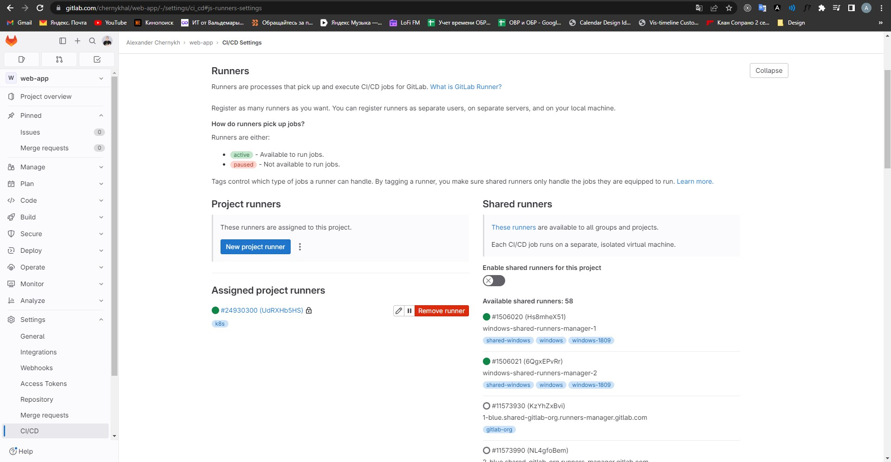
Для дальнейшей сборки и деплоя приложения создадим конфиг .gitlab-ci.yml:
```
stages:                                      # пайплайн поделен на 2 этапа
  - build                                    # билд образа и пуш в gitlab registry
  - deploy                                   # деплой приложения как ресурс кубера

variables:                              
  IMAGE_TAG: $CI_COMMIT_SHORT_SHA            # версионирование сделано на базе SHA коммита для простоты
  K8S_NAMESPACE: default                     # неймспейс в котором будет публиковаться приложение
  K8S_DEPLOYMENT_NAME: web-app-deployment    # имя deployment`a приложения
  K8S_SERVICE_NAME: web-app-service          # имя service приложения
  
build:                                       # джоба билд
  stage: build
  image:
    name: gcr.io/kaniko-project/executor:v1.9.0-debug # образ kaniko позволяет собрать docker image внутри kubernetes кластера
    entrypoint: [""]
  script:
    - /kaniko/executor
      --context "${CI_PROJECT_DIR}"
      --dockerfile "${CI_PROJECT_DIR}/dockerfile"
      --destination "${CI_REGISTRY_IMAGE}:${IMAGE_TAG}"    
  only:
    - main

deploy:
  image:
    name: bitnami/kubectl:latest
    entrypoint: ['']
  stage: deploy
  script:
    - kubectl config get-contexts
    - kubectl config use-context chernykhal/web-app:gitlab-agent     # важно использовать контекст агента, без него, kubectl не найдет права на создание ресурсов
    - |
      kubectl apply -f - <<EOF
      ---
      apiVersion: apps/v1
      kind: Deployment
      metadata:
        name: $K8S_DEPLOYMENT_NAME
        namespace: $K8S_NAMESPACE
      spec:
        replicas: 3
        selector:
          matchLabels:
            app: $K8S_DEPLOYMENT_NAME
        template:
          metadata:
            labels:
              app: $K8S_DEPLOYMENT_NAME
          spec:
            containers:
              - name: $K8S_DEPLOYMENT_NAME
                image: $CI_REGISTRY_IMAGE:$IMAGE_TAG
                ports:
                  - containerPort: 80
      ---
      apiVersion: v1
      kind: Service
      metadata:
        name: $K8S_SERVICE_NAME
        namespace: $K8S_NAMESPACE
      spec:
        selector:
          app: $K8S_DEPLOYMENT_NAME
        ports:
          - name: http
            protocol: TCP
            port: 80
            targetPort: 80
            nodePort: 30000
        type: NodePort
      EOF
  environment:
    name: production
  only:
    - main
```

Проверить работоспособность можно запушив новое изменение в репозитории, например добавление версии 1.0.0:
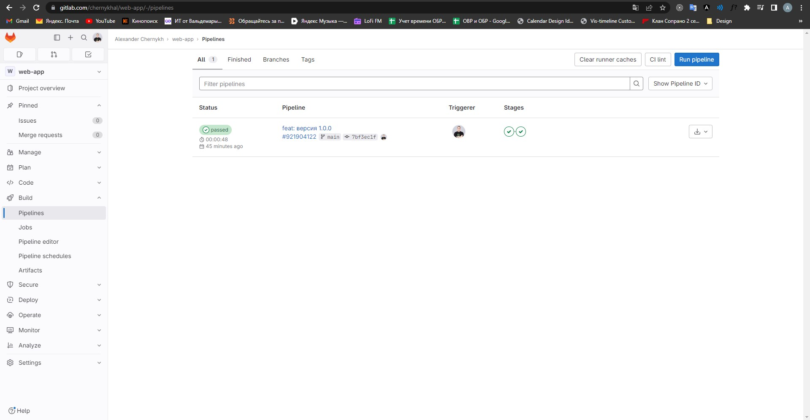
После внесения изменений в ветку main, gitlab-runner тригерится на изменения и запускает пайплайн.
В результате наши изменения пришли на кластер успешно:
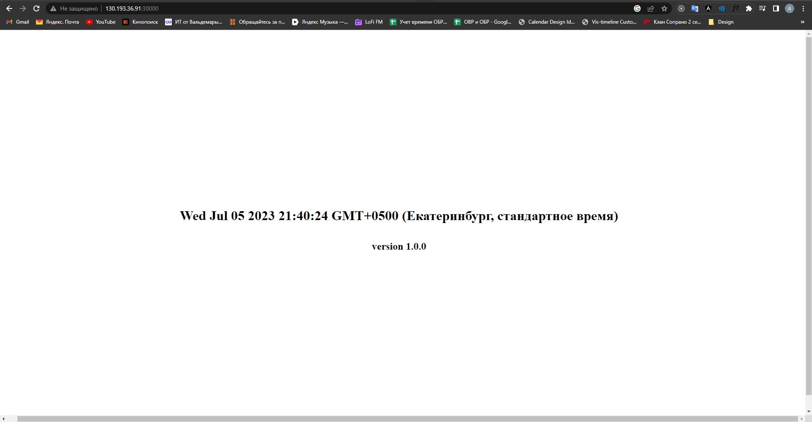
Проверим еще раз, увеличив patch версию до 1.0.2:
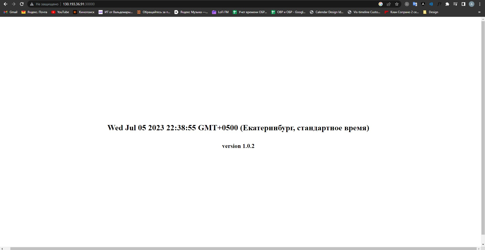
Обновление прошло успешно и приложение задеплоилось.
Ссылка на репозиторий - https://gitlab.com/chernykhal/web-app

Ссылка на приложение - http://130.193.36.91:30000/ http://158.160.2.78:30000/ http://51.250.33.83:30000/

Ссылка на пайплайны - https://gitlab.com/chernykhal/web-app/-/pipelines

Ссылка на образы - https://gitlab.com/chernykhal/web-app/container_registry/4356240

Также видим, что в графане обновились метрики:
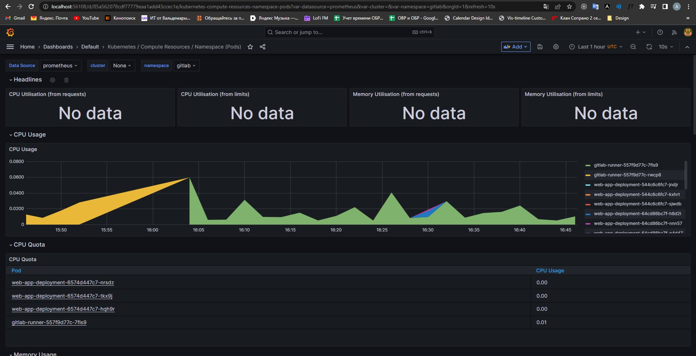

